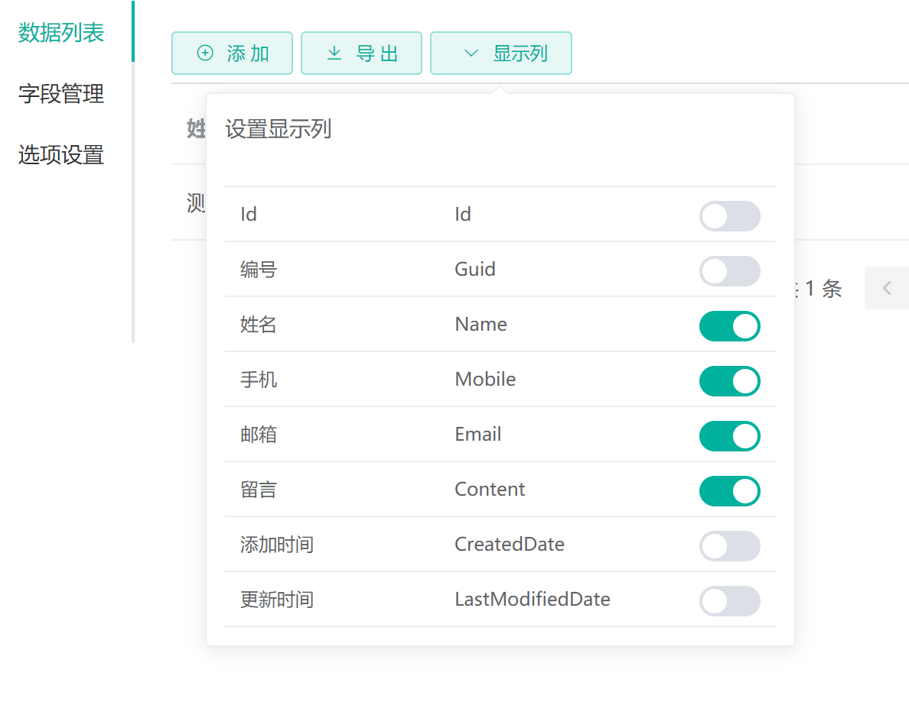
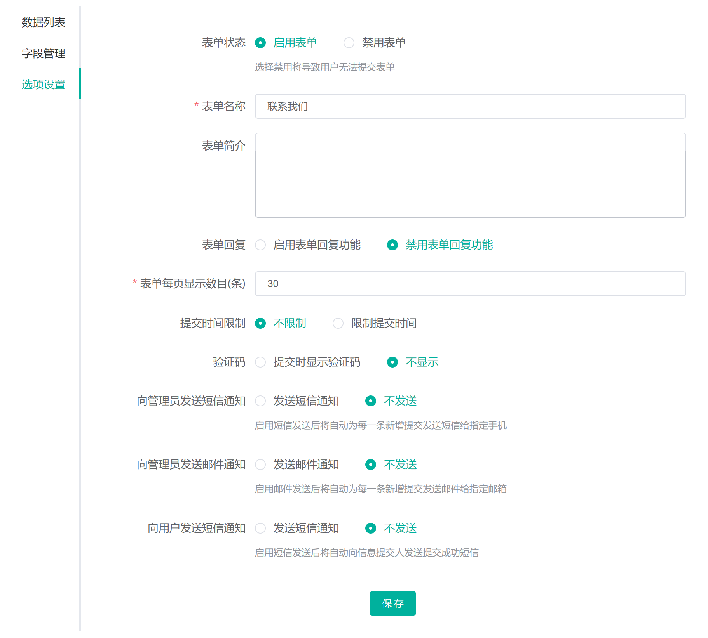

# 表单管理界面

每个表单均有独立的管理界面，进入 表单 -> 表单管理 菜单，点击表单名称进入表单的管理界面：

在表单管理界面中，左侧可以切换数据列表、字段管理与选项设置，下面我们分别进行说明：

###数据列表

数据列表是表单数据的管理界面，在此可以对表单数据进行新增、修改、删除以及导出等操作。

需要注意的是 显示列 功能，点击显示列按钮：

选中对应的字段，在数据列表中将出现对应字段的值，其中字段 `Id`、`Guid`、`CreatedDate`以及`LastModifiedDate`为系统字段，分别对应数据的数据库Id、唯一标识、添加时间以及更新时间。

::: warning
如果需要前台页面显示表单数据，后台设置的显示列将影响默认表单列表模板（list1）的显示字段。
::: 

###字段管理

点击左侧字段管理链接，进入表单字段管理界面：

在此可以编辑表单的字段以及验证规则，表单插件支持字段的导出以及导入，可以通过导出导入快速创建相同字段的表单。

字段管理的详细说明请参考 表单字段 文档。

###选项设置

点击左侧选项设置链接，进入表单选项设置界面：

* **表单状态** 如果选择禁用表单，前台页面的表单将提示表单已禁用，禁止用户提交表单；
* **表单回复** 设置表单是否启用回复功能；
* **提交时间限制** 设置表单提交时间后，表单只能在指定的时间段内提交数据；
* **验证码** 设置前台页面提交表单是否开启验证码，开启验证码后能屏蔽机器自动提交数据；
* **向管理员发送短信通知** 启用短信发送后将自动为每一条新增提交发送短信给指定手机；
* **向管理员发送邮件通知** 启用邮件发送后将自动为每一条新增提交发送邮件给指定邮箱；
* **向用户发送短信通知** 启用短信发送后将自动向信息提交人发送提交成功短信；