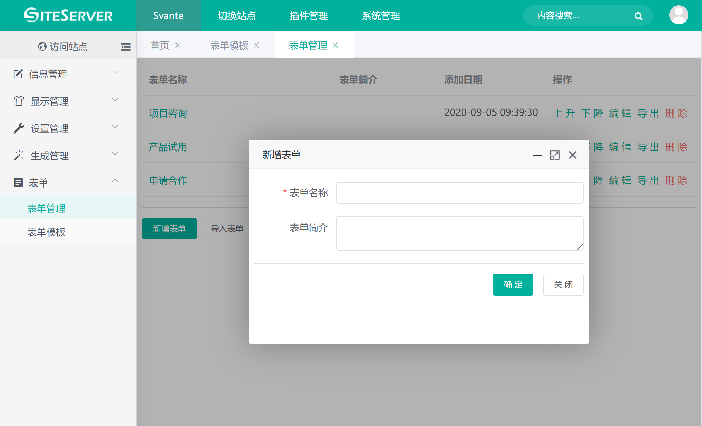
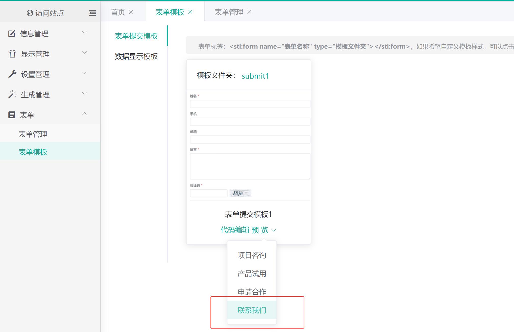
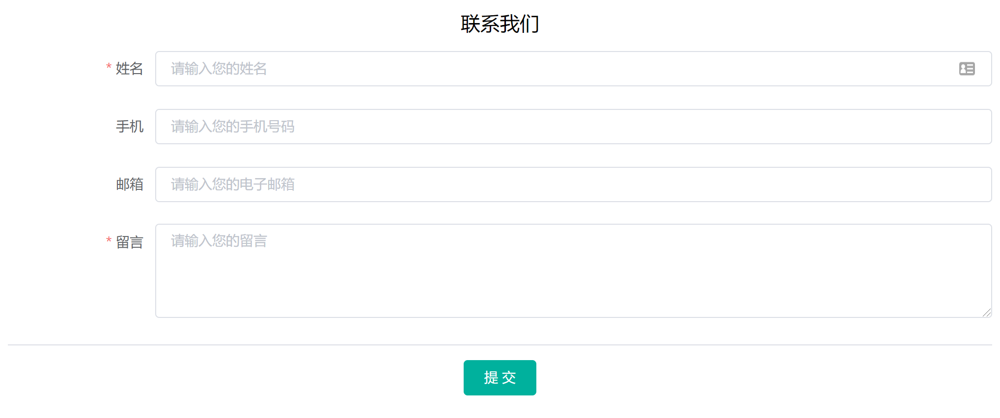
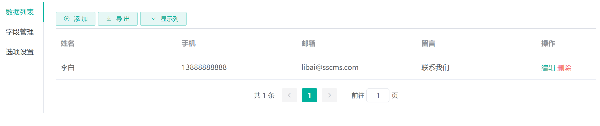
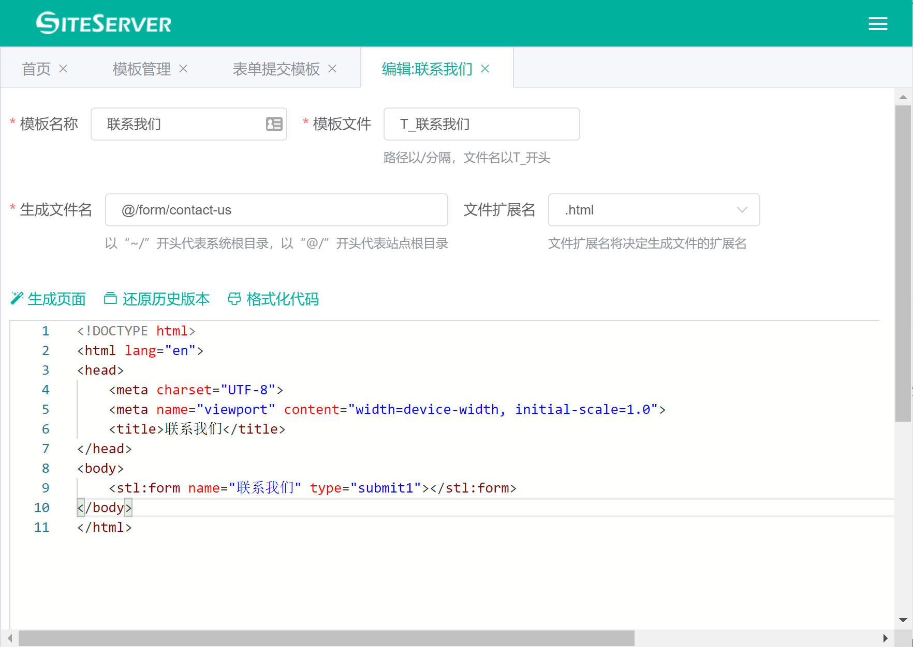

# 开始使用

让我们从创建表单并在页面上显示表单开始，本教程通过示例说明如何创建并在页面上显示表单。

###创建表单

首先，在 SS CMS 管理界面中打开 表单 -> 表单管理 菜单，点击 新增表单 按钮：



输入表单名称，如联系我们，点击确定创建表单，新创建的表单默认将包含姓名、手机、邮箱以及留言字段。

###预览表单

创建完毕后，进入 表单 -> 表单模板 菜单：



在预览下拉框中选择我们新创建的联系我们表单，系统将弹出表单预览窗口：



在此，我们输入测试数据，点击提交完成表单填写。

###查看数据

再此进入 表单 -> 表单管理 菜单，点击联系我们表单，进入联系我们表单管理界面：



可以看到，在数据列表界面中，我们提交的测试数据已经显示在列表中了，说明数据已经提交成功。

###显示表单

最后，我们需要将表单显示在前台页面中，让访问者能够提交数据。

通常的做法是为每一个表单单独创建单页模板，用来显示表单提交界面。

进入 显示管理 -> 模板管理 菜单，进入模板管理界面，在最下方点击 新增单页模板 按钮，进入单页模板新增界面：



我们为单页模板设置模板名称及生成文件名，并添加如下代码：

```html
<!DOCTYPE html>
<html lang="en">
<head>
    <meta charset="UTF-8">
    <meta name="viewport" content="width=device-width, initial-scale=1.0">
    <title>联系我们</title>
</head>
<body>
    <stl:form name="联系我们" type="submit1"></stl:form>
</body>
</html>
```

其中 `<stl:form>` 标签用于显示表单提交界面，`name` 属性指定表单名称，`type` 属性指定表单提交样式。

保存模板后，访问单页模板页面，如：`/form/contact-us.html`，我们将看到页面中显示联系我们表单了。