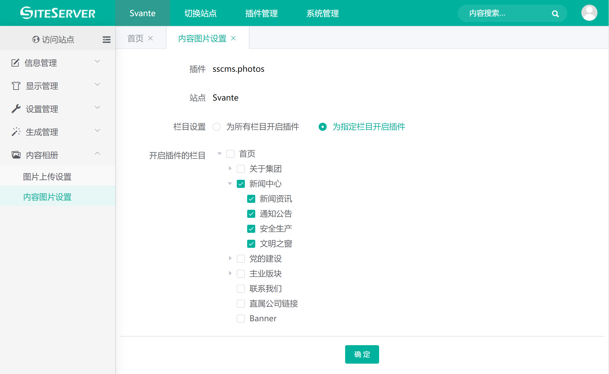
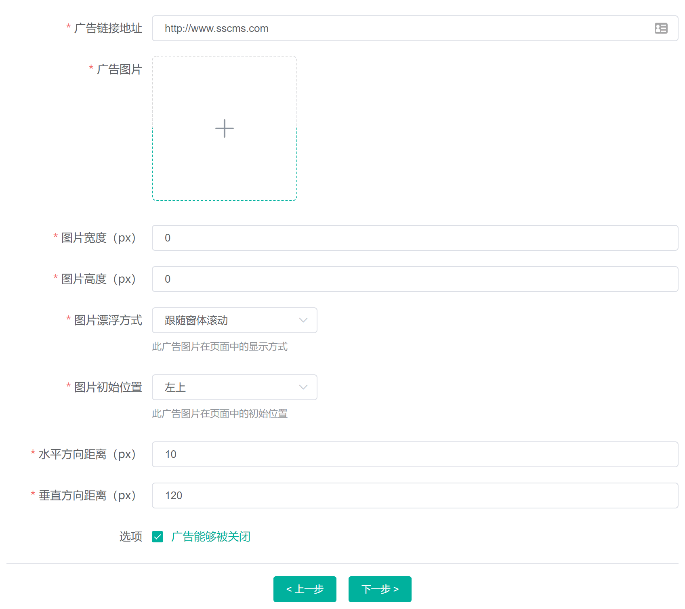
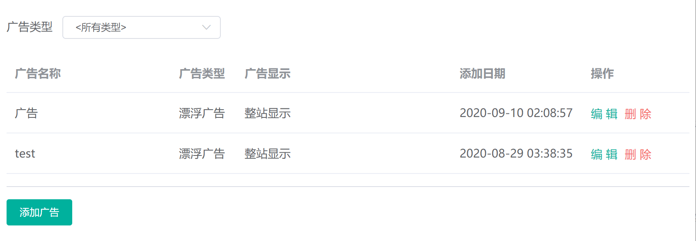
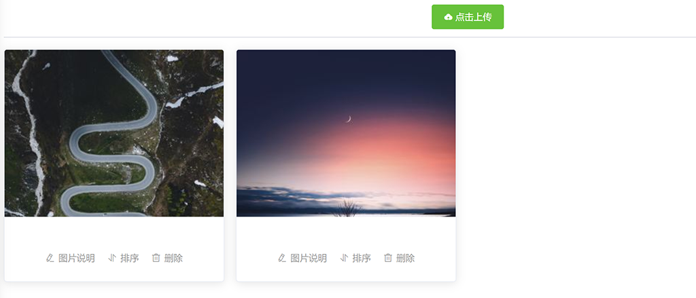

# 插件的使用

###开启多图上传

内容相册插件安装好之后，需要进入 `内容相册 -> 内容图片设置` 菜单，设置启用插件的栏目：



勾选栏目后点击确定，设置成功后进入 `信息管理 -> 内容管理` 菜单，点击相应栏目进入内容管理界面：



可以看到，在内容列表的右侧，出现了 `内容相册` 链接，点击链接进入内容相册管理界面：



点击 **点击上传** 按钮，可以批量选择图片进行上传。



上传完毕后可能对图片进行排序、删除操作，同时插件支持对图片设置图片说明文字。

###`<stl:photo>` 标签

| 属性 | 可能的取值 | 简介 |
|  |  | 显示内容属性的类型 |
|  | Id | 图片ID |
|  | SmallUrl | 显示缩略图 |
|  | MiddleUrl | 显示小图 |
|  | LargeUrl | 显示原图 |
|  | ItemIndex | 图片序号 |
|  | Description | 图片描述 |

`<stl:photos>` 标签用于遍历图片，例如将以下代码放至内容模板中：

```html
<stl:photos>
  <stl:photo type="SmallUrl"></stl:photo>
  <br/><br/>
</stl:photos>
```

###`<stl:slide>` 标签

`<stl:slide>` 标签用于幻灯片播放：

```html
<stl:slide></stl:slide>
```